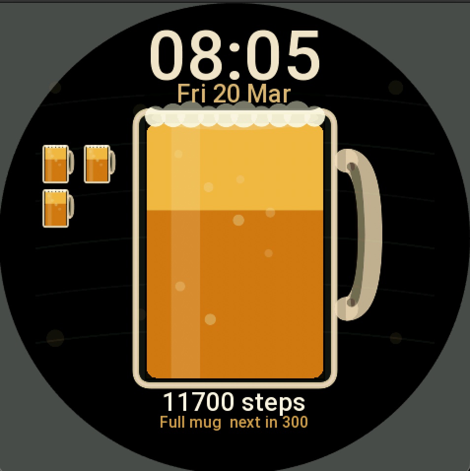

# Beer Time
This watchface was fully created with Codex.

Beer Time is a Zepp OS watchface for Amazfit devices where your daily steps fill a giant beer mug.




## Features

- Daily steps on screen
- Big mug that fills as you walk
- One mini mug added for every completed step goal
- Editable step goal from `1000` to `10000`
- Tap on the steps area opens the system steps screen

## How It Works

- The mug fills during the current step cycle
- At the configured goal, the big mug resets and a mini mug is added
- The goal can be changed from the watchface edit screen

## Project Notes

- Main watchface logic: `watchface/index.js`
- Asset generator: `scripts/generate-assets.js`
- App config and supported devices: `app.json`

## Regenerating Assets

```bash
node scripts/generate-assets.js
```

## License

MIT
